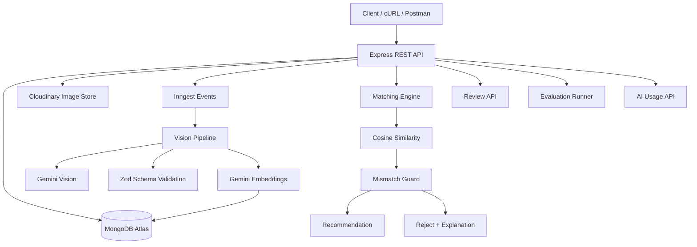
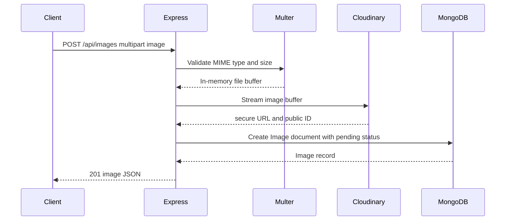
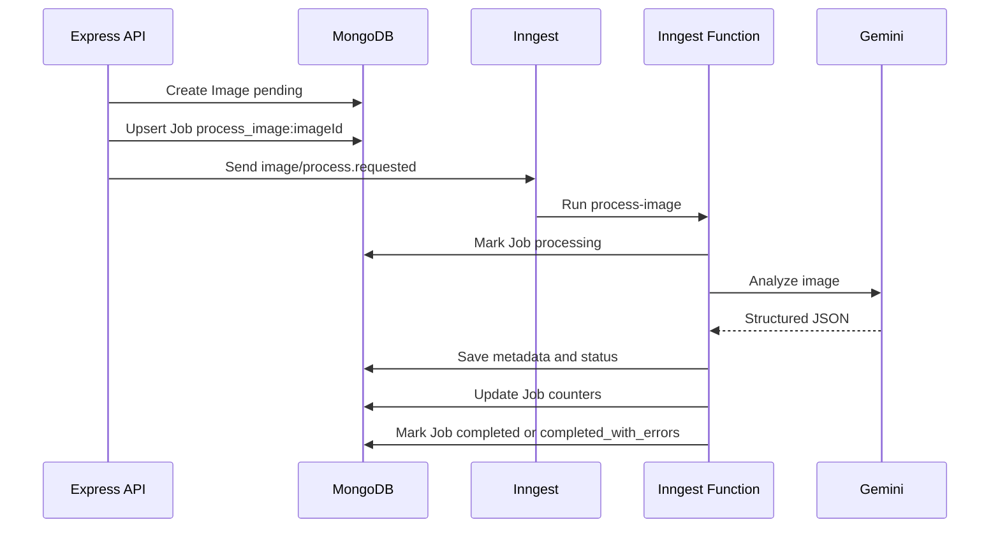
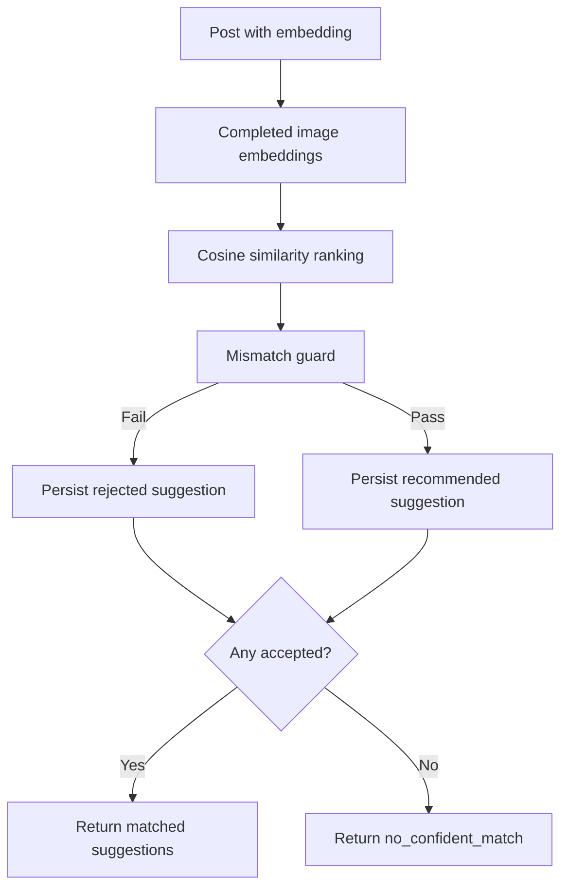
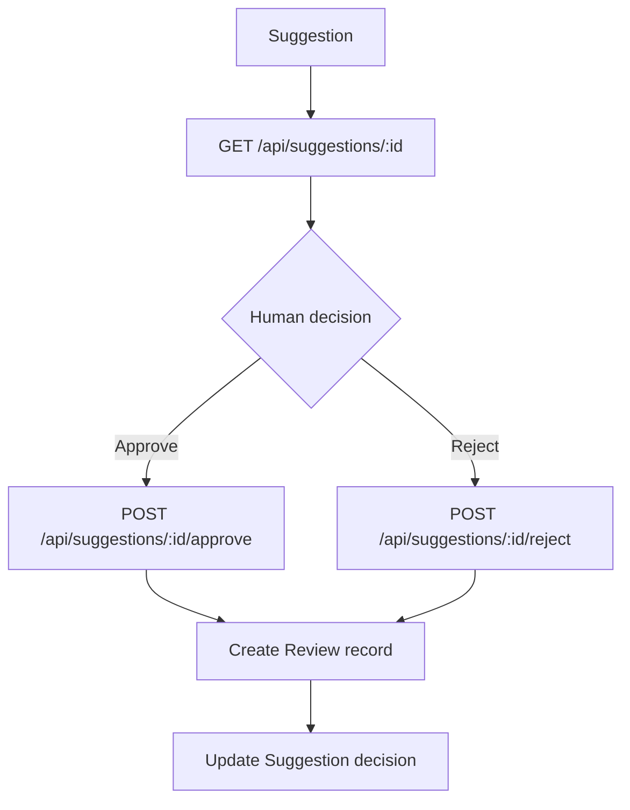

# Architecture

## System Diagram



## Layers

- Routes handle HTTP paths.
- Controllers translate HTTP input/output.
- Services contain business logic and integrations.
- Models define MongoDB persistence.
- Utilities contain shared pure logic such as cosine similarity.
- Jobs contain Inngest background functions.

## Collections

### Image

Stores Cloudinary references, vision metadata, processing status, attempts, errors, and embeddings.

Indexes planned:
- `processingStatus`
- `subject`
- `category`

### Post

Stores blog title/content, article metadata, and embeddings.

Indexes planned:
- `subject`
- `category`

### Suggestion

Stores candidate matches, similarity score, guard result, final decision, and explanations.

Indexes planned:
- `postId`
- `imageId`
- `guardStatus`

### Review

Stores human approval or rejection decisions.

### Job

Stores background processing progress and failure state.

Indexes planned:
- `status`

### AIUsage

Stores Gemini usage and estimated cost records for vision and embedding calls.

Indexes planned:
- `operation`

## Idempotency Strategy

Image processing will check the current image status before expensive work. A completed image will not be processed again unless explicitly reprocessed by a future endpoint. Pending or failed images can be retried, while processing attempts and errors are recorded.

## Reproducible Index Setup

Run:

```bash
npm run migrate
```

The script connects to MongoDB Atlas using `MONGODB_URI` and calls `syncIndexes()` for all Mongoose models. Without `MONGODB_URI`, it exits safely with a clear error.

## Image Storage Flow



MongoDB stores Cloudinary metadata and processing state, never raw image binary data.

## Async Processing Flow



Repeated single-image enqueueing uses deterministic job IDs, so duplicate events do not create duplicate job records.

## AI Usage Tracking

Gemini services pass usage metadata to `costTrackingService`, which writes `AIUsage` records with:
- provider and model
- operation such as `vision`
- related `imageId` or `postId`
- input, output, and total tokens
- estimated cost

Usage logging is intentionally non-blocking for image processing. If usage persistence fails, the failure is logged without retrying the Gemini call only because the audit write failed.

## Embeddings and Similarity

Image and Post documents store embedding arrays directly in MongoDB. For the expected capstone scale of roughly 50 images, matching will load candidate embeddings and calculate cosine similarity in JavaScript.

Cosine similarity is implemented in `src/utils/cosineSimilarity.js` with:
- array validation
- numeric value validation
- dimension checks
- zero-vector protection

## Matching and Guard Flow



The guard rejects candidates that fail similarity, confidence, subject, or category checks. This prevents the highest-scoring wrong image from being returned as the least-bad answer.

## Review Workflow



Review records preserve human decisions, while the Suggestion keeps the current review outcome for easy querying.

## Deployment Direction

The project will target a free or low-cost Node.js-compatible host such as Render, Railway, or Fly.io, using MongoDB Atlas, Cloudinary, Gemini, and Inngest environment variables. Deployment will not be marked verified until a real `/health` request succeeds against the deployed URL.
